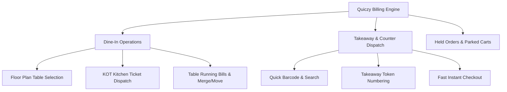

# Billing & POS Operations Overview

Quiczy POS delivers a high-speed, touch-optimized billing engine designed to handle fast counter checkout, complex table dining, custom item modifiers, multiple tax tiers, and split payments.

---

## 🍽️ Supported Order Channels



### 1. Dine-In (Table Dining)
- Table-based ordering with visual floor plan representation.
- Split orders, seat assignment, kitchen routing, and running table tabs.
- Multiple rounds of food ordering with incremental KOT generation.

### 2. Takeaway (Fast Counter Sales)
- Quick product selection and immediate tender checkout.
- Automated takeaway token generation for customer order calling.
- Optional customer name/phone attribution.

### 3. Held Orders (Parked Carts)
- Park incomplete carts when customers step away to grab additional items.
- Resume held orders on any terminal with a single tap.

---

## 🧭 Billing Workspace Layout

```text
┌────────────────────────────────────────────────────────┬─────────────────────────────┐
│ Category Tabs: [All] [Burgers] [Beverages] [Sides]     │ 🛒 Active Cart (Table T-04) │
├────────────────────────────────────────────────────────┼─────────────────────────────┤
│ 🔍 Search Products...           [📷 Barcode Scan]     │ 1x Classic Cheeseburger     │
│                                                        │    + Extra Bacon ($1.50)    │
│ ┌──────────────┐ ┌──────────────┐ ┌──────────────┐    │    + No Onion               │
│ │ Cheeseburger │ │ Crispy Fries │ │ Cold Brew    │    │    $12.50                   │
│ │ $11.00       │ │ $4.50        │ │ $5.00        │    │ 2x Mango Iced Tea           │
│ └──────────────┘ └──────────────┘ └──────────────┘    │    $9.00                    │
│ ┌──────────────┐ ┌──────────────┐ ┌──────────────┐    ├─────────────────────────────┤
│ │ Margherita   │ │ Chicken Wings│ │ Brownie Sund │    │ Subtotal:           $21.50  │
│ │ $14.00       │ │ $9.50        │ │ $6.50        │    │ Discount (10% VIP): -$2.15  │
│ └──────────────┘ └──────────────┘ └──────────────┘    │ Taxes (CGST+SGST):   $1.94  │
│                                                        │ Total:              $21.29  │
│                                                        ├─────────────────────────────┤
│                                                        │ [HOLD]  [KOT]  [PAY NOW →]  │
└────────────────────────────────────────────────────────┴─────────────────────────────┘
```

---

## 🔐 Required Permissions
- Accessing Billing: `canCheckout`
- Applying manual discounts: `canApplyDiscount`
- Editing line item prices on the fly: `canEditProductPrice`
