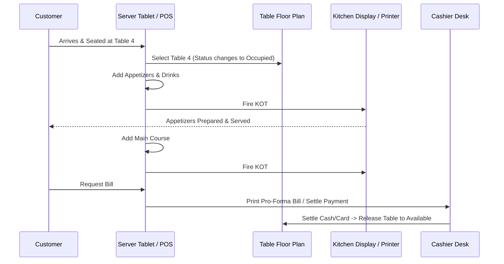

# Dine-In Workflow & Table Ordering

The **Dine-In Workflow** manages full-service restaurant operations from table seating, incremental food ordering, kitchen ticket (KOT) firing, running bill modifications, to table payment and release.

---

## 🍽️ Complete Dine-In Lifecycle

---

## 📝 Step-by-Step Table Ordering Guide

### Step 1: Open Dine-In Console
- From the main navigation, tap **Billing** and select **Dine-In** (or tap **Tables**).
- The visual [Floor Plan](../tables/floor-plan.md) displays all dining sections and tables with real-time occupancy status.

### Step 2: Select a Table
- Tap an **Available (Green)** table to seat a new party.
- If guest counts are enabled, enter the number of guests/covers.

### Step 3: Add Items to Order
- Browse category tabs or search products by name/SKU.
- Tapping an item with modifiers (e.g. burger doneness, pizza toppings, spice levels) opens the [Modifier Selector](product-modifiers.md).
- Adjust quantities with `+` / `-` buttons.

### Step 4: Fire KOT to Kitchen
- Tap the **Send to Kitchen / KOT** button.
- **Incremental Routing**: Quiczy POS tracks which items are already printed. Only newly added items are sent to the kitchen and bar printers, preventing duplicate food preparation.
- The table status updates to **Occupied / Cooking (Orange/Blue)** with a live timer badge.

### Step 5: Settle Payment & Release Table
- When the party is ready to pay, tap **Pay Now →**.
- Select the payment method (Cash, Card, UPI, Split Tender) in the [Checkout Screen](checkout-payments.md).
- Once payment is confirmed, the invoice prints, receipt numbers are logged, and the table automatically transitions back to **Available (Green)**.

---

## 🔄 Special Table Actions

| Action | Description | Permission Required |
| :--- | :--- | :--- |
| **Move Table** | Transfer all running items and KOTs from Table A to Table B (e.g. guests moved to outdoor patio). | `canCheckout` |
| **Merge Tables** | Combine running tabs from Table 1 and Table 2 into a single unified bill for large group parties. | `canCheckout` |
| **Split Bill** | Divide the table total evenly or split by specific line items among multiple guests. | `canCheckout` |
| **Void Line Item** | Remove an item after sending to kitchen (requires managerial reason capture). | `canVoidTransactions` |
