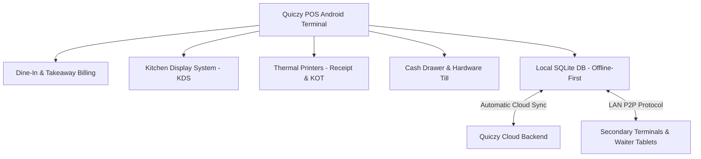

# Introduction to Quiczy POS

Welcome to the **Quiczy POS Product Manual**. Quiczy POS is an enterprise-grade Android Point of Sale system built specifically for high-velocity retail stores, restaurants, cafes, and multi-counter hospitality businesses.

---

## 🌟 What is Quiczy POS?

Quiczy POS unites counter billing, table floor plan operations, kitchen order tickets (KOT), real-time kitchen displays (KDS), cloud sync, multi-terminal peer-to-peer (P2P) synchronization, and thermal printer hardware into a unified touch-first Android platform.

---

## 🔑 Key Architecture & Capabilities

1. **Offline-First Resilience**: All core transactions, table orders, cart calculations, tax engines, and printer operations execute 100% locally on device SQLite/Room storage. No internet connection is required during business rush hours.
2. **Multi-Terminal P2P Sync**: When multiple POS registers or waiter tablets operate on the same local Wi-Fi network, orders, table occupancy, and kitchen tickets synchronize directly over LAN sockets even without internet access.
3. **Role-Based Access Control (RBAC)**: Enforces strict separation between **Owner**, **Admin**, **Manager**, **Cashier**, and **Staff** with 17 granular operational permissions.
4. **Shift & Cash Accountability**: Automated float reconciliation, expected drawer balancing, shift-based tracking, and single-click X/Z report generation.
5. **Kitchen Display & KOT Workflow**: Instant routing of food/drink items to dedicated kitchen stations (Kitchen, Bar, Grill, Bakery) with color-coded preparation timers and expo recall.

---

## 👥 Who Is This Manual For?

- **Store Owners & General Managers**: Configure business profiles, tax structures, user roles, pricing, and view end-of-day analytics.
- **Cashiers & Counter Staff**: Ring up sales, process split payments, issue receipts, handle refunds, and manage cash drawers.
- **Floor Managers & Waitstaff**: Manage dining room tables, seat guests, take table orders, apply split bills, and track preparation statuses.
- **Kitchen & Expo Supervisors**: Monitor incoming kitchen order tickets on KDS screens and mark items as in-progress or ready.
- **System Administrators & Installers**: Set up hardware peripherals, network printers, barcode scanners, and customer-facing secondary displays.

---

## 📚 Navigating the Documentation

Use the sidebar navigation or search bar (`Cmd + K` / `Ctrl + K`) to find any workflow, screen guide, permission rule, or troubleshooting procedure.
