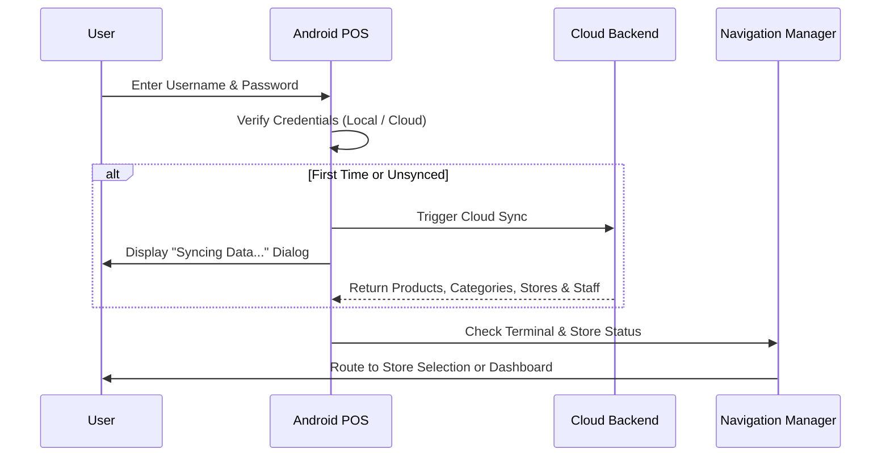

# Terminal Login & Master Authentication

Once a terminal is activated, the **Terminal Login** screen allows the business owner, store manager, or administrator to sign in and initiate the POS operations for the day.

---

## 📸 Screen Overview

_Figure 1: Quiczy POS Master Terminal Login Screen._

---

## 🔑 Login Fields & Inputs

1. **User Name**: Enter your administrative or cashier username (e.g., `admin_john` or `manager1`).
2. **Password**: Enter the account password.
3. **Forgot Password?**: Generates a secure recovery trigger sent to the verified administrator email address.
4. **Log In Button (`Log In →`)**: Authenticates credentials against the local encrypted database or cloud server.
5. **Register Now**: Quick link to register a new business account if needed.

---

## 🔄 Authentication & Sync Flow

When you tap **Log In →**, Quiczy POS executes the following background sequence:

---

## 🔐 Roles Allowed
- SUPER_ADMIN
- OWNER
- ADMIN
- MANAGER
- CASHIER

---

## ⚠️ Troubleshooting Login Issues

> [!IMPORTANT]
> If the device is currently offline:
> - You can log in using any previously cached credentials on this device.
> - New staff accounts created on other terminals will only sync after this device reconnects to Wi-Fi/Internet or synchronizes via [LAN P2P](../offline-mode/p2p-lan-sync.md).
