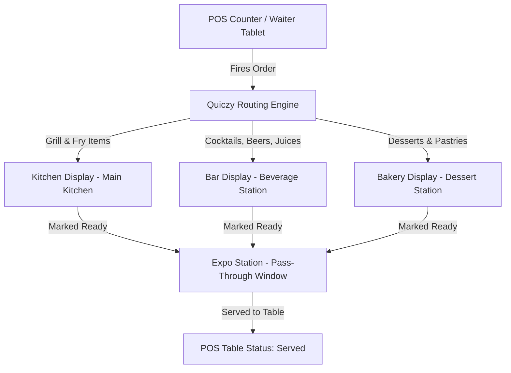

# Kitchen Display System (KDS & KOT) Overview

Quiczy POS includes a built-in, native **Kitchen Display System (KDS)** that replaces or supplements paper kitchen order tickets (KOT). KDS screens installed in the kitchen, bar, grill, and prep stations give kitchen staff real-time visibility into incoming orders, ticket timers, and preparation queues.

---

## 🍳 KDS Station Routing Architecture



---

## 🖥️ Screen Layout & Station Filtering

```text
┌────────────────────────────────────────────────────────────────────────────────────────┐
│ Station Tabs: [All Stations] [🔥 Kitchen] [🍸 Bar] [🍰 Bakery]           [08:26 PM]    │
├────────────────────┬────────────────────┬────────────────────┬─────────────────────────┤
│ T-04 (Dine-In)     │ T-09 (Dine-In)     │ TK-12 (Takeaway)   │ T-02 (Dine-In)          │
│ ⏱️ 04:12 (Normal)  │ ⏱️ 12:45 (Warning) │ ⏱️ 22:10 (Overdue) │ ⏱️ 02:30 (Normal)       │
│ Server: Sarah      │ Server: Mike       │ Cashier: Ajith     │ Server: Sarah           │
├────────────────────┼────────────────────┼────────────────────┼─────────────────────────┤
│ [ ] 1x Cheeseburger│ [x] 2x Pasta Pesto │ [ ] 1x Family Combo│ [ ] 2x Cold Brew        │
│   • Well Done      │ [ ] 1x Garlic Bread│   • Coke + Fries   │ [ ] 1x Lemon Soda       │
│ [ ] 1x French Fries│                    │ [ ] 1x Chkn Burger │                         │
├────────────────────┼────────────────────┼────────────────────┼─────────────────────────┤
│ [MARK ALL READY]   │ [MARK ALL READY]   │ [MARK ALL READY]   │ [MARK ALL READY]        │
└────────────────────┴────────────────────┴────────────────────┴─────────────────────────┘
```

---

## ⏱️ Color-Coded Kitchen Timers

KDS cards feature prominent, dynamic timer badges that shift color based on elapsed preparation time:
- 🟢 **Normal (0 - 10 mins)**: Order is fresh and in normal preparation workflow.
- 🟡 **Warning (10 - 20 mins)**: Order is approaching target fulfillment time.
- 🔴 **Overdue / Urgent (20+ mins)**: High-priority ticket alert requiring immediate expediting.

*(Thresholds are customizable in [App Preferences](../settings/app-preferences.md)).*
