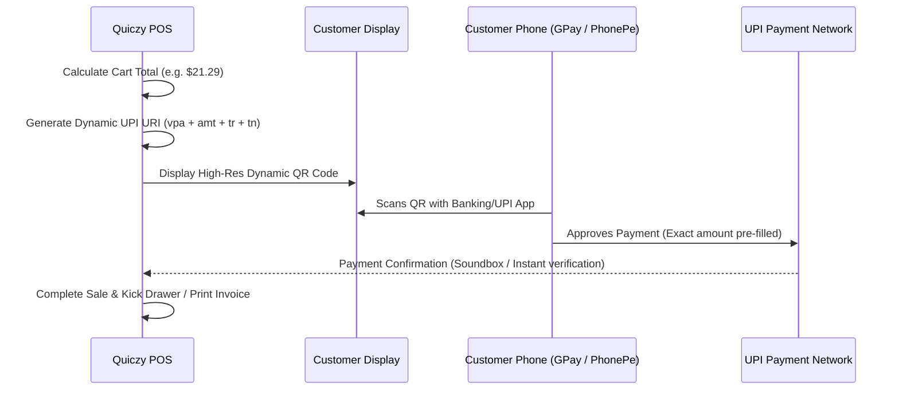

# Dynamic UPI QR Payments & Instant Verification

Quiczy POS incorporates native **Dynamic UPI QR Code Generation**, generating real-time, amount-locked QR codes that eliminate manual entry errors by patrons.

---

## 📲 How Dynamic UPI Works

---

## 🛠️ Configuring Store UPI VPA

1. Navigate to **Settings** → **Payment Settings**.
2. Tap **UPI Configuration**.
3. **Enter Details**:
   - **Merchant VPA / UPI ID**: (e.g., `acmestore@okhdfcbank` or `billing.cafe@icici`).
   - **Payee Name**: (e.g., `Acme Retail POS`).
   - **Merchant Category Code (MCC)**: (Optional standard business code).
4. Tap **Save & Test UPI QR**.
5. The terminal renders a test QR code for validation with small test amounts ($1.00).
