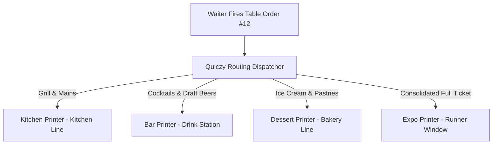

# Kitchen Printer Routing & Multi-Station KOTs

In food service environments with dedicated preparation areas, Quiczy POS routes individual items on an order ticket to specific physical kitchen printers.

---

## 🍽️ Multi-Station Printing Flow

---

## 🛠️ Setting Up Kitchen Printers

1. Go to **Settings** → **Printer Settings** → **Kitchen Printers**.
2. Tap **+ Add Kitchen Station** (e.g. `Hot Kitchen`, `Bar Station`, `Pizza Oven`).
3. Assign the physical printer (e.g., LAN Printer at `192.168.1.201`).
4. **Category Mapping**:
   - Check all categories routed to this station (e.g., *Burgers*, *Pizzas*, *Appetizers* mapped to *Hot Kitchen*; *Cocktails*, *Beers*, *Smoothies* mapped to *Bar Station*).
5. **KOT Printing Format**:
   - Select large font mode for high readability across the kitchen line.
   - Enable automated buzzer/chime beep on print to alert cooks.
6. Tap **Save Station**.

---

## 📋 Incremental KOT Behavior

When a server adds subsequent rounds of food to an existing table:
- Quiczy POS prints only the newly added line items.
- The KOT header prominently displays **KOT #2 (ROUND 2)** with the updated table timestamp to eliminate kitchen confusion.
