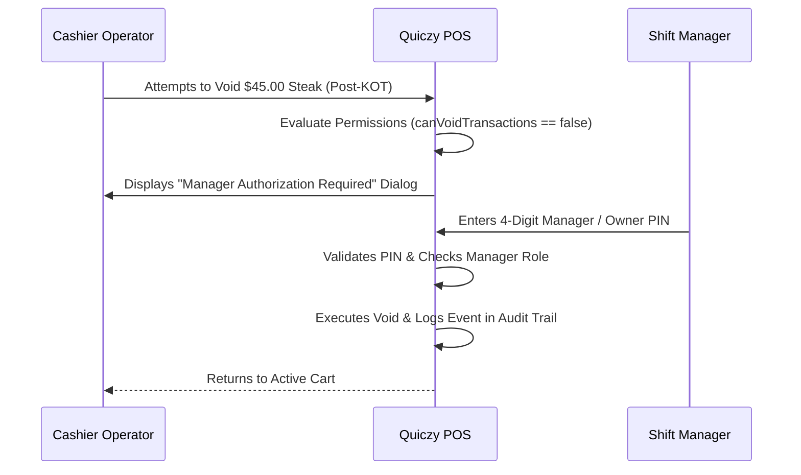

# Manager Override & PIN Authorization

To balance cashier operational speed with loss prevention, high-risk actions attempted by junior staff trigger an inline **Manager PIN Authorization Dialog**.

---

## 🛑 Actions Requiring Manager Approval

When attempted by a cashier or staff member without direct permissions:
1. **Voiding a Line Item After KOT Printing**
2. **Applying Discounts Exceeding Maximum Cashier Limits (e.g. > 15%)**
3. **Overriding Product Unit Price**
4. **Processing High-Value Refunds**
5. **Manually Kicking the Cash Drawer Without a Sale**
6. **Clearing or Deleting Active Carts**

---

## 🔑 How the Authorization Overlay Works

---

## 📜 Audit Trail Logging

Every manager override is permanently logged in the **Global Audit Log** recording:
- Timestamp & Terminal ID
- Action Attempted
- Requesting Cashier Name
- Authorizing Manager Name
- Reason entered (if applicable)
